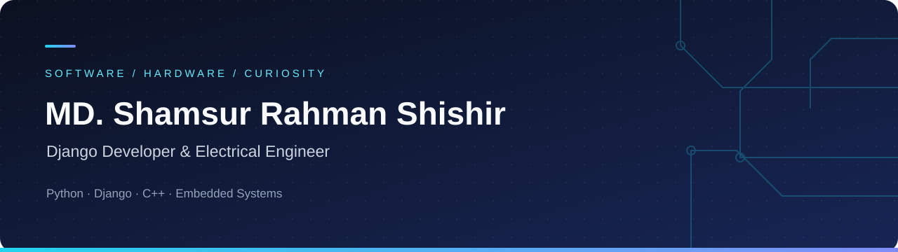

  

  <b>Building useful software. Exploring the hardware behind it.</b> 
  Django developer · Electrical engineer · Embedded systems enthusiast 
  Bangladesh

  
  
  

---

### A little about me

I enjoy connecting software and hardware: building web applications with **Python and Django**, and exploring how **embedded systems** work.

- **Working on:** embedded systems projects.
- **Learning:** embedded systems engineering.
- **Happy to discuss:** Python, Django, C++, and AVR.
- **Beyond code:** I love a good meme.

### My toolbox

| Area | Languages & tools |
| :--- | :--- |
| Programming | Python · C++ · Java · JavaScript |
| Web development | Django · Next.js · HTML · CSS · Bootstrap · Tailwind CSS |
| Hardware & engineering | Arduino · AVR · MATLAB |
| Data & computer vision | Pandas · OpenCV · TensorFlow |
| Databases | MySQL · SQLite |
| Development & design | Git · Linux · Illustrator · Photoshop |

   &nbsp;
   &nbsp;
   &nbsp;
   &nbsp;
   &nbsp;
  

### Explore my work

Visit my **[portfolio](https://srsprofile.pythonanywhere.com/#top)** or browse my **[GitHub repositories](https://github.com/ShamsurRahmanShishir?tab=repositories)** to see what I’m building.

### Let’s connect

**[Email](mailto:shams007srs@gmail.com)** · **[Kaggle](https://www.kaggle.com/shamsur007)** · **[X](https://x.com/shamsurrahmans2)** · **[CodePen](https://codepen.io/shamsur-shishir)** · **[Instagram](https://www.instagram.com/none_but_who/)**

<!-- Add LinkedIn and Facebook once their exact profile URLs have been confirmed. -->

---

Always curious. Always building.

